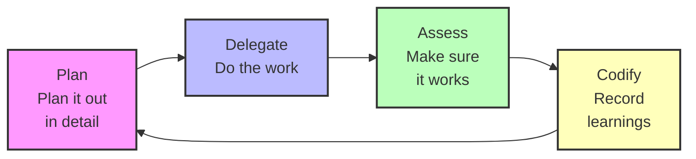

# AI Stack Engineering

A Claude Code plugin marketplace for Digitalis.io featuring specialized AI agents and workflows for our technology stack: Go, React/TypeScript, Apache Cassandra, PostgreSQL, Apache Kafka, and OpenSearch.

## Attribution

**This project is based on [every-marketplace](https://github.com/EveryInc/every-marketplace) by Every, Inc.**

We are deeply grateful to [Kieran Klaassen](https://github.com/kieranklaassen) and the team at Every for creating the original Compounding Engineering Philosophy and plugin framework. Their innovative work on AI-powered development workflows has inspired us to create a customized version tailored to our tech stack at Digitalis.io.

This fork maintains the core philosophy while adapting the agents and tooling to focus on the technologies we use daily: Go backends, React/TypeScript frontends, and our data infrastructure built on Cassandra, PostgreSQL, Kafka, and OpenSearch.

## Quick start

### Standard Installation
Run Claude and add the marketplace:

```
/plugin marketplace add https://github.com/digitalis-io/ai-stack-engineering
```

Then install the plugin:

```
/plugin install ai-stack-engineering
```

### One-Command Installation
Use the [Claude Plugins CLI](https://claude-plugins.dev) to skip the marketplace setup:
```bash
npx claude-plugins install @digitalis-io/ai-stack-engineering/ai-stack-engineering
```

This automatically adds the marketplace and installs the plugin in a single step.

## Available plugins

### AI Stack Engineering

AI-powered development tools customized for the Digitalis.io tech stack. Includes specialized agents for Go, React, Cassandra, PostgreSQL, Kafka, and OpenSearch, along with commands and workflows that embody the compounding engineering philosophy.

**Tech Stack Focus:**

- **Backend:** Go with idiomatic patterns, concurrency, and error handling
- **Frontend:** React with TypeScript, modern hooks, and best practices
- **Databases:** Apache Cassandra data modeling, PostgreSQL optimization
- **Streaming:** Apache Kafka event-driven architecture and patterns
- **Search:** OpenSearch full-text search and analytics

**Features:**

- Code review with multiple expert perspectives tailored to our stack
- Automated testing and bug reproduction
- PR management and parallel comment resolution
- Documentation generation and maintenance
- Security, performance, and architecture analysis
- Stack-specific agents for Go, Cassandra, Kafka, React, PostgreSQL, and OpenSearch

**Philosophy:**

Each unit of engineering work makes subsequent units of work easier—not harder.



1. **Plan** → Break down tasks with clear steps
2. **Delegate** → Execute with AI assistance
3. **Assess** → Test thoroughly and verify quality
4. **Codify** → Record learnings for next time

[Learn more about compounding engineering](https://every.to/source-code/my-ai-had-already-fixed-the-code-before-i-saw-it)

## Planned Agents

Our marketplace includes specialized agents for the Digitalis.io tech stack:

### Backend & Infrastructure
- **golang-reviewer** - Pragmatic Go code review: concurrency safety, error handling, database integration
- **cassandra-architect** - Battle-tested data modeling: partition design, query patterns, avoiding hot partitions
- **kafka-guardian** - Event streaming reliability: delivery guarantees, offset management, rebalancing
- **search-architect** - OpenSearch/Elasticsearch: relevance tuning, index design, query performance

### Frontend
- **react-reviewer** - Modern React patterns: hooks, performance, TypeScript, avoiding re-renders

### General (inherited from original)
- Architecture and system design
- Code quality and simplicity
- Security and data integrity
- Best practices research
- Documentation and knowledge codification

## Contributing

This is a customized fork for Digitalis.io's internal use. If you're interested in the original project or want to create your own tech stack-specific fork, please visit the [original every-marketplace repository](https://github.com/EveryInc/every-marketplace).

## License

MIT License - See LICENSE file for details. Based on every-marketplace by Every, Inc.
