# AI Stack Engineering

**Transform your engineering workflow from linear to exponential through compounding AI automation.**

[](https://opensource.org/licenses/MIT)
[](https://github.com/EveryInc/every-marketplace)
[](https://digitalis.io)

A Claude Code plugin marketplace featuring specialized AI agents and workflows customized for modern distributed systems: **Go, Java/Spring Boot, React/TypeScript, Apache Cassandra, PostgreSQL, Apache Kafka, and OpenSearch**.

---

## 🌟 Overview

AI Stack Engineering brings the **Compounding Engineering Philosophy** to your development workflow. Each unit of work doesn't just complete a task—it teaches the system, making every subsequent task easier, faster, and higher quality.

This isn't just another AI coding assistant. It's a fundamental shift in how we build software:
- **Linear AI**: Helps with today's problem, starts fresh tomorrow
- **Compounding AI**: Learns from every interaction, applies patterns automatically, prevents entire categories of bugs

## 🎯 Why This Exists

At [Digitalis.io](https://digitalis.io), we work with complex distributed systems daily. While AI assistants help with individual tasks, we needed something that:
- **Learns** from our specific tech stack patterns
- **Prevents** the bugs we've seen in production
- **Scales** our engineering expertise across the team
- **Compounds** knowledge over time, not just solves today's problem

This project customizes the brilliant [compounding engineering framework](https://github.com/EveryInc/every-marketplace) by [Every, Inc.](https://every.to) for our specific technology stack.

## 🙏 Attribution

**This project is based on [every-marketplace](https://github.com/EveryInc/every-marketplace) by Every, Inc.**

We are deeply grateful to [Kieran Klaassen](https://github.com/kieranklaassen) and the team at [Every](https://every.to) for creating the Compounding Engineering Philosophy and the original plugin framework. Their innovative vision of AI-powered development workflows inspired us to create this specialized version.

Our contribution focuses on adapting their framework for distributed systems engineering with our specific tech stack while maintaining the core philosophy that makes it powerful.

## 🚀 Quick Start

### Installation

#### Method 1: Quick Install (Recommended)
```bash
# 1. Add marketplace directly from GitHub
claude /plugin marketplace add https://github.com/digitalis-io/ai-stack-engineering

# 2. Install the plugin
claude /plugin install ai-stack-engineering

# 3. (Recommended) Install Context7 for up-to-date docs
claude mcp add --transport sse context7 https://mcp.context7.com/sse
```

#### Method 2: Local Install (For Customization)
```bash
# 1. Clone the repository
git clone https://github.com/digitalis-io/ai-stack-engineering

# 2. Add marketplace from local path
claude /plugin marketplace add ./ai-stack-engineering

# 3. Install the plugin
claude /plugin install ai-stack-engineering

# 4. (Recommended) Install Context7 for up-to-date docs
claude mcp add --transport sse context7 https://mcp.context7.com/sse
```

### Verify Installation

```bash
/plugin list   # Should show ai-stack-engineering
/mcp list      # Should show Context7 (if installed)
/review        # Test the review command
```

### Your First Compounding Experience

```bash
# Plan a feature with AI research
claude /plan "Build Kafka consumer that writes to Cassandra"

# Execute the plan
claude /work

# Review with specialized agents
claude /review

# The magic: Next time you build something similar,
# the system already knows your patterns
```

## 🔄 The Compounding Engineering Workflow

```mermaid
flowchart LR
    subgraph TODAY["🌱 Today: First Feature"]
        A1[PLAN<br/>30 min] --> B1[DELEGATE<br/>2 hours]
        B1 --> C1[ASSESS<br/>1 hour]
        C1 --> D1[CODIFY<br/>30 min]
    end

    subgraph TOMORROW["🌿 Tomorrow: Pattern Recognition"]
        A2[PLAN<br/>15 min] --> B2[DELEGATE<br/>1 hour]
        B2 --> C2[ASSESS<br/>30 min]
        C2 --> D2[CODIFY<br/>15 min]
    end

    subgraph NEXTWEEK["🌳 Next Week: Acceleration"]
        A3[PLAN<br/>5 min] --> B3[DELEGATE<br/>30 min]
        B3 --> C3[ASSESS<br/>15 min]
        C3 --> D3[CODIFY<br/>5 min]
    end

    subgraph NEXTMONTH["🚀 Next Month: Compound Mastery"]
        A4[PLAN<br/>2 min] --> B4[DELEGATE<br/>10 min]
        B4 --> C4[ASSESS<br/>5 min]
        C4 --> D4[CODIFY<br/>2 min]
    end

    D1 ===>|"Learns your<br/>patterns"| A2
    D2 ===>|"Prevents your<br/>bugs"| A3
    D3 ===>|"Knows your<br/>stack"| A4

    style TODAY fill:#ffe4e1
    style TOMORROW fill:#ffd4a3
    style NEXTWEEK fill:#c3f0c3
    style NEXTMONTH fill:#b4e7ff
```



### What This Really Means:

**Week 1:** 4 hours to build a feature (learning your patterns)
**Week 2:** 2 hours for similar complexity (applying patterns)
**Month 2:** 40 minutes for the same work (full compound effect)

The system learns:
- ✅ Your code style and conventions
- ✅ Your common bugs and how to prevent them
- ✅ Your architecture patterns
- ✅ Your tech stack quirks (Cassandra partitions, Kafka offsets, Go concurrency)

**The Result**: Not just faster development, but exponentially better code quality.

## 🤖 Our Tech Stack Agents

### Specialized for Distributed Systems (6 Custom Agents)

#### `golang-reviewer`
*"I've debugged production at 3am. Make it obvious, make it work, make it fast—in that order."*
- Catches concurrency bugs, goroutine leaks, race conditions
- Enforces idiomatic Go patterns (Uber style guide)
- Production-ready error handling and observability

#### `java-craftsman`
*"I've seen AbstractSingletonProxyFactoryBean and lived. Keep it simple."*
- Prevents overengineering and enterprise anti-patterns
- Spring Boot configuration and best practices
- SOLID principles without the religion

#### `cassandra-guardian`
*"Ah, another hot partition in the making. Let me save you from 3am alerts."*
- Modern features: SAI indexes, vector search, UCS compaction
- Prevents unbounded partitions and tombstone disasters
- Data modeling that actually scales

#### `kafka-guardian`
*"At-least-once usually means at-least-twice. Let's fix that."*
- Ensures delivery guarantees actually work
- Prevents data loss during rebalancing
- Consumer group management that survives production

#### `react-reviewer`
*"Every unnecessary re-render is death by a thousand paper cuts."*
- Catches hook dependency issues before they bite
- Prevents infinite re-render loops
- TypeScript that actually helps

#### `search-sentinel`
*"Your fancy query DSL doesn't matter if users can't find anything."*
- OpenSearch/Elasticsearch relevance tuning
- Query performance at scale
- Index design that doesn't explode

### Core Engineering Agents (17 from Original)

**Code Quality**: `code-simplicity-reviewer`, `security-sentinel`, `performance-oracle`
**Architecture**: `architecture-strategist`, `pattern-recognition-specialist`
**Data**: `data-integrity-guardian` (PostgreSQL specialist)
**Research**: `framework-docs-researcher`, `best-practices-researcher`
**Workflow**: `pr-comment-resolver`, `feedback-codifier`
**Language Experts**: Rails, Python, TypeScript reviewers

## 📚 Documentation

### Essential Guides
- 📖 **[Workflow Guide](docs/WORKFLOW_GUIDE.md)** - Comprehensive guide to compounding engineering
- 🚀 **[Quick Start](docs/QUICK_START.md)** - Get running in 5 minutes
- 📝 **[Article: The Philosophy](https://every.to/p/my-ai-is-already-fixed-the-code)** - Original concept by Every

### Commands Reference

| Command | Purpose | What It Does |
|---------|---------|--------------|
| `/plan` | Strategic planning | Researches best practices, creates implementation phases |
| `/work` | Execute tasks | Implements with learned patterns applied |
| `/review` | Multi-agent review | Parallel analysis by all specialized agents |
| `/triage` | Issue prioritization | Decides what to fix and in what order |
| `/resolve` | Parallel fixes | Resolves multiple issues simultaneously |
| `/context` | Memory management | Monitors token usage and suggests compaction |

## 📈 Real-World Impact

### Metrics from Production Use (Every's Cora Email Product)

| Metric | Before | After 3 Months | Improvement |
|--------|--------|----------------|-------------|
| Feature Delivery | 1-2 weeks | 1-3 days | **5-10x faster** |
| Bugs in Production | 15-20 per release | 3-5 per release | **75% reduction** |
| PR Review Time | 2-3 days | 2-4 hours | **10x faster** |
| Onboarding Time | 2-3 months | 1-2 weeks | **6x faster** |

### Expected Impact for Distributed Systems

- **Cassandra**: Prevent hot partitions before they happen
- **Kafka**: Eliminate data loss from offset mismanagement
- **Go Services**: Catch concurrency bugs in review, not production
- **React Apps**: Fix performance issues before users complain
- **Java/Spring**: Avoid enterprise pattern hell

## 💡 Philosophy: The Mindset Shift

### Traditional Engineering
```
Fix bug → Done
Write feature → Done
Review code → Done
```

### Compounding Engineering
```
Fix bug → Test added → Pattern recorded → Category prevented
Write feature → Pattern learned → Reused automatically
Review code → Standards extracted → Applied forever
```

**Every bug becomes impossible to repeat.**
**Every review makes future code better.**
**Every feature becomes a reusable pattern.**

## 🏢 About Digitalis.io

[Digitalis.io](https://digitalis.io) specializes in:
- **Cassandra Consulting**: From modeling to operations at scale
- **Kafka Architecture**: Event-driven systems that don't lose data
- **Distributed Systems**: Building systems that scale
- **AxonOps**: Cassandra observability and management platform

We've taken these production learnings and encoded them into our AI agents.

## 🤝 Contributing

While this is a customized fork for our tech stack, we welcome:
- **Bug Reports**: Found an issue? [Open an issue](https://github.com/digitalis-io/ai-stack-engineering/issues)
- **Stack Adaptations**: Want to fork for your stack? We'll help!
- **Agent Improvements**: Better patterns for our tech? PR welcome!

For the original framework or different tech stacks, visit [every-marketplace](https://github.com/EveryInc/every-marketplace).

## 🔗 Related Projects

- **[Every Marketplace](https://github.com/EveryInc/every-marketplace)** - The original framework
- **[AxonOps](https://axonops.com)** - Our Cassandra observability platform
- **[Apache Cassandra](https://cassandra.apache.org)** - The database that scales
- **[Apache Kafka](https://kafka.apache.org)** - Event streaming platform
- **[OpenSearch](https://opensearch.org)** - Search and analytics engine

## 📄 License

MIT License - See [LICENSE](LICENSE) file for details.

Based on every-marketplace by Every, Inc., used under MIT License.

---

<div align="center">

**Ready to compound your engineering?**

[⭐ Star this repo](https://github.com/digitalis-io/ai-stack-engineering) • [🐛 Report an issue](https://github.com/digitalis-io/ai-stack-engineering/issues) • [💬 Join the discussion](https://github.com/digitalis-io/ai-stack-engineering/discussions)

Built with ❤️ by [Digitalis.io](https://digitalis.io) • Inspired by [Every](https://every.to)

</div>