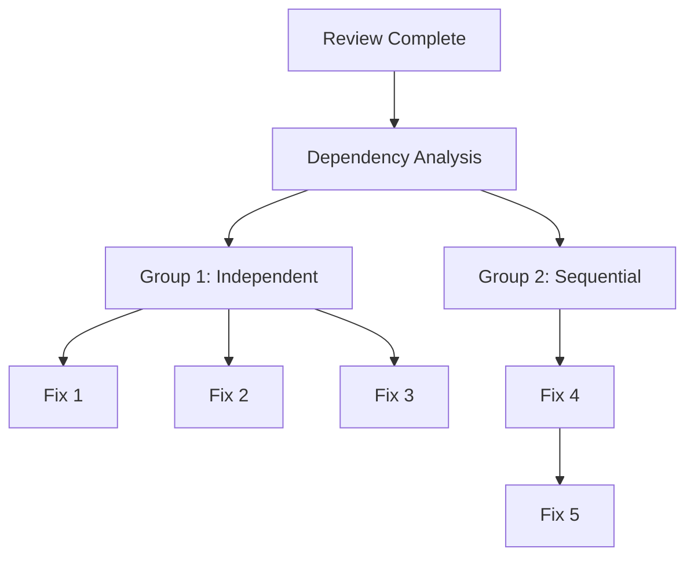
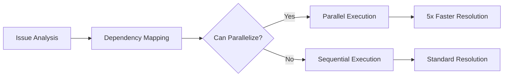

# AI Stack Engineering Workflow Guide: The Compounding Engineering Philosophy

> 🚀 **Transform your engineering workflow from linear to exponential.** Each unit of work makes the next one easier—that's the power of compounding engineering.

## Table of Contents

1. [Introduction: The Compounding Engineering Philosophy](#introduction-the-compounding-engineering-philosophy)
2. [Core Concepts](#core-concepts)
3. [Installation & Setup](#installation--setup)
4. [The Four-Phase Compounding Workflow](#the-four-phase-compounding-workflow)
5. [Advanced Features](#advanced-features)
6. [Best Practices for Our Tech Stack](#best-practices-for-our-tech-stack)
7. [The Compounding Engineering Playbook](#the-compounding-engineering-playbook)
8. [Common Workflows & Complete Examples](#common-workflows--complete-examples)
9. [Commands Reference](#commands-reference)
10. [Specialized Agents Deep Dive](#specialized-agents-deep-dive)
11. [Real-World Impact](#real-world-impact)
12. [Troubleshooting](#troubleshooting)
13. [Tips & Tricks](#tips--tricks)
14. [Philosophy: From Typing Code to Designing Systems](#philosophy-from-typing-code-to-designing-systems)
15. [Comparison with Other Approaches](#comparison-with-other-approaches)
16. [Getting Started: Your First Compounding Experiment](#getting-started-your-first-compounding-experiment)
17. [Advanced: Building Custom Evaluations](#advanced-building-custom-evaluations)
18. [Work Trees and Git Integration](#work-trees-and-git-integration)
19. [Context Management Strategies](#context-management-strategies)
20. [Team Collaboration Patterns](#team-collaboration-patterns)
21. [Parallel Orchestration Architecture](#parallel-orchestration-architecture)
22. [Living Documentation](#living-documentation)
23. [The Three-Lane Mission Control](#the-three-lane-mission-control)
24. [Metrics and ROI](#metrics-and-roi)
25. [The Future of Compounding Engineering](#the-future-of-compounding-engineering)

---

## Introduction: The Compounding Engineering Philosophy

### The Core Principle

**Each unit of engineering work should make subsequent units of work easier—not harder.**

This isn't just another AI coding assistant. This is a fundamental shift in how we approach software engineering at Digitalis.io. While traditional AI engineering provides linear improvements (today's problem, today's solution), compounding engineering creates exponential returns (today's solution becomes tomorrow's foundation).

### Why Compounding Matters

Traditional AI Engineering:
```
Day 1: Fix bug → ✓ Bug fixed
Day 2: Similar bug → Start from scratch
Day 30: Same pattern → Still starting from scratch
```

Compounding Engineering:
```
Day 1: Fix bug → ✓ Bug fixed + Test + Rule + Knowledge
Day 2: Similar bug → Automatically prevented
Day 30: Category of bugs → Impossible to occur
```

### The Shift for Digitalis.io

With our stack (Go, Java, React/TypeScript, Cassandra, PostgreSQL, Kafka, OpenSearch), we're not just writing code—we're building a system that:
- Learns from every Cassandra hot partition
- Prevents Kafka consumer lag issues before they happen
- Optimizes Go concurrency patterns automatically
- Prevents Java overengineering and AbstractFactoryFactory disasters
- Catches React re-render issues in review
- Builds on PostgreSQL query patterns
- Improves OpenSearch relevance with each iteration

### Real Benefits and Metrics

From production usage at Every (Cora email product):
- **Time-to-ship**: Week+ → 1-3 days average
- **Bugs caught before production**: 3x increase
- **PR review cycles**: Days → Hours
- **Feature velocity**: Increasing over time (the compound effect!)
- **Cost**: $400/month vs $400k/year in engineers

🔄 **Compounding:** Every metric improves over time, not just initially.

---

## Core Concepts

### Building Systems with Memory

Your development environment isn't stateless—it remembers:
- Every architectural decision
- Every bug pattern
- Every performance optimization
- Every code review preference
- Every team convention

### The Knowledge Persistence Layer

Two critical files maintain your system's memory:

**CLAUDE.md** - Your tactical preferences:
```markdown
# Code Style
- Guard clauses over nested ifs
- Table-driven tests for Go
- Hooks composition in React
- CQL prepared statements always

# Naming Conventions
- Services: noun_verb (user_creator)
- Handlers: HandleResourceAction
- Components: PascalCase with purpose
```

**llms.txt** - Your strategic decisions:
```markdown
# Architecture
- Event sourcing for audit trail
- CQRS for read-heavy workloads
- Cassandra for time series
- Kafka for async processing
- PostgreSQL for transactional data
```

### Three-Lane Workflow (Mission Control)

Imagine three terminals, three lanes of work:

```
┌─────────────────┐ ┌─────────────────┐ ┌─────────────────┐
│   LEFT LANE     │ │  MIDDLE LANE    │ │  RIGHT LANE     │
│    PLANNING     │ │   DELEGATING    │ │   REVIEWING     │
├─────────────────┤ ├─────────────────┤ ├─────────────────┤
│ • Read issues   │ │ • Take plans    │ │ • Review code   │
│ • Research      │ │ • Write code    │ │ • Check CLAUDE  │
│ • Write plans   │ │ • Create tests  │ │ • Suggest fixes │
│ • Architecture  │ │ • Implement     │ │ • Validate      │
└─────────────────┘ └─────────────────┘ └─────────────────┘
```

### Trust but Verify

- **Trust**: Let AI agents work independently
- **Verify**: Multiple specialized reviewers check output
- **Codify**: Turn verifications into permanent rules

### Cost Comparison

Traditional approach:
- Senior engineer: $200k-400k/year
- Limited to 8 hours/day
- Context switches expensive
- Knowledge leaves with employee

Compounding approach:
- Claude Code: $400/month
- Works 24/7 if needed
- Perfect context retention
- Knowledge accumulates permanently

---

## Installation & Setup

### Prerequisites

- Claude Code CLI installed
- Git repository initialized
- GitHub account (for issue tracking)
- Basic understanding of your tech stack

### Installation Method 1: Quick Install (Recommended)

```bash
# Add marketplace directly from GitHub
claude /plugin marketplace add https://github.com/digitalis-io/ai-stack-engineering

# Install the plugin
claude /plugin install ai-stack-engineering
```

### Installation Method 2: Local Install (For Customization)

```bash
# Clone the repository
git clone https://github.com/digitalis-io/ai-stack-engineering
cd ai-stack-engineering

# Add marketplace from local path
claude /plugin marketplace add ./ai-stack-engineering

# Install the plugin
claude /plugin install ai-stack-engineering
```

### Step 3: Verify Installation

```bash
# Test a command
claude /review

# Test an agent
claude agent golang-reviewer "check this Go code"
```

### Step 4: Initial Configuration

Create your initial CLAUDE.md:
```bash
cat > CLAUDE.md << 'EOF'
# AI Stack Engineering - Digitalis.io Preferences

## Go Conventions
- Table-driven tests always
- Context as first parameter
- Explicit error returns

## Cassandra Rules
- Partition keys chosen for even distribution
- Prepared statements mandatory
- UCS compaction for time-series

## Kafka Patterns
- Idempotent consumers
- At-least-once delivery
- Consumer group management

## React Guidelines
- Hooks over classes
- Memoization for expensive renders
- TypeScript strict mode
EOF
```

✅ **Example:** Your first setup takes 10 minutes. Every project after this takes 30 seconds.

---

## Installing Context7 MCP for Up-to-Date Documentation

Context7 is an MCP (Model Context Protocol) server that provides Claude with up-to-date, version-specific documentation for libraries and frameworks. This prevents outdated code examples and hallucinated APIs.

### Why Use Context7

- **Get current documentation** for Cassandra, Kafka, PostgreSQL, OpenSearch, React, and Go libraries
- **Avoid outdated patterns** from Claude's training data
- **Ensure version-specific accuracy** for your tech stack
- **Prevent hallucinated APIs** that don't exist

### Installation (Recommended - Remote SSE)

```bash
claude mcp add --transport sse context7 https://mcp.context7.com/sse
```

### Verification

```bash
/mcp list  # Should show Context7
```

### Using Context7

Our specialized agents automatically use Context7 when available to fetch:

- **Cassandra**: Latest CQL syntax, SAI indexes, vector search, UCS compaction
- **Kafka**: Current producer/consumer APIs and delivery guarantees
- **PostgreSQL**: Latest SQL features and optimization techniques
- **OpenSearch**: Current query DSL and aggregation patterns
- **React**: Latest hooks, patterns, and TypeScript integration
- **Go**: Current standard library idioms and popular package APIs
- **Java/Spring Boot**: Latest Spring features, annotations, and best practices

💡 **Tip:** Context7 adds slight token usage and latency when fetching docs, but the accuracy improvement is worth it for rapidly evolving libraries.

### Testing Context7 Integration

Verify Context7 is working with your agents:

```bash
# 1. Check Context7 is installed
/mcp list  # Should show context7

# 2. Test doc fetching with an agent
claude agent cassandra-guardian "Explain vector search in Cassandra 5.0"
# Should return current Cassandra 5.0 vector features, not outdated info

# 3. Verify version-specific information
claude agent golang-reviewer "Show me Go 1.21 generic patterns"
# Should provide Go 1.21+ specific syntax

# 4. Test deprecated pattern detection
claude agent kafka-guardian "Is auto.offset.reset=smallest valid?"
# Should flag this as deprecated (now uses 'earliest')
```

**How to know Context7 is working:**
- Agents reference specific version numbers in responses
- Documentation citations include recent features
- No hallucinated APIs or methods that don't exist
- Deprecated patterns are correctly identified

---

## The Four-Phase Compounding Workflow

### PLAN Phase: Teach Through Work

The planning phase isn't just about what to build—it's about teaching the system how you think about problems.

💡 **Clarification:** When documentation mentions "creating issues" during planning, this refers to LOCAL markdown files in your work tree that are structured like GitHub issues for clarity. These are NOT actual issues created on github.com.

#### Using the `/plan` Command

```bash
claude /plan "Build a Go microservice that consumes from Kafka,
             processes events, and writes to Cassandra"
```

What happens behind the scenes:
1. **Research agent** investigates (6 minutes, ~50k tokens):
   - Best practices for Kafka consumers in Go
   - Cassandra data modeling for your use case
   - Error handling patterns

2. **Best practices agent** compiles:
   - Industry standards
   - Common pitfalls
   - Performance considerations

3. **Framework agent** structures:
   - Project layout
   - Dependency choices
   - Integration patterns

#### The Generated Output

⚠️ **Terminology Note:** The `/plan` command creates a LOCAL markdown file in your work tree, NOT an actual GitHub issue on github.com.

Creates a local planning document `issues/kafka-cassandra-processor.md`:
```markdown
# Kafka to Cassandra Event Processor

## Architecture Decisions
- Segmentio Kafka client (proven production stability)
- GoCQL for Cassandra (official DataStax driver)
- Separate consumer groups per event type
- Write-ahead log for exactly-once semantics

## Phases
### Phase 1: Infrastructure Setup
- Kafka connection with retry logic
- Cassandra cluster connection
- Health check endpoints
- Structured logging

### Phase 2: Core Processing
- Event schema validation
- Transformation pipeline
- Batch writing to Cassandra
- Error handling with DLQ

### Phase 3: Observability
- Prometheus metrics
- Consumer lag monitoring
- Cassandra write latency tracking
- Distributed tracing

### Phase 4: Testing
- Unit tests with mocked dependencies
- Integration tests with TestContainers
- Load testing with vegeta
- Chaos testing scenarios
```

🔄 **Compounding:** Every architectural decision becomes a reusable pattern for future services.

#### Work Tree Creation

A new Git work tree is created automatically:
```bash
git worktree add -b feature/kafka-cassandra-processor
```

This provides complete isolation for development without disturbing your main branch.

💡 **Tip:** Work trees are especially powerful for existing codebases—you can experiment freely while maintaining stable context.

### DELEGATE Phase: Execute with Context

This is where plans become reality, but with crucial differences from traditional development.

#### Using `/delegate` and `/work`

```bash
# Start execution
claude /delegate

# Work on specific phase
claude /work "Phase 1: Infrastructure Setup"
```

#### The To-Do Tool (Not Just Markdown!)

⚠️ **Critical Distinction:** Tasks live in Claude's to-do tool, not markdown files. This means:
- Tasks persist across context compaction
- Progress tracked automatically
- Dependencies managed intelligently
- State maintained between sessions

Example to-do structure:
```
✓ Set up Kafka consumer configuration
✓ Implement Cassandra connection pool
⟳ Create health check endpoints
○ Add structured logging
○ Write connection retry logic
```

#### Phase-by-Phase Execution

Each phase completes before the next begins:

**Phase 1 execution:**
```go
// kafka/consumer.go
type Consumer struct {
    reader *kafka.Reader
    db     *gocql.Session
    logger *zap.Logger
}

func NewConsumer(config Config) (*Consumer, error) {
    // Implementation following patterns from CLAUDE.md
}
```

After Phase 1 completes:
```bash
✅ Phase 1 Complete. Review before proceeding? [Y/n]
```

#### Context Management

Before starting a new phase:
```bash
claude /context
```

Output:
```
Context Usage: ████████░░ 78% (156k/200k tokens)
Phases completed: 2/4
Estimated tokens for Phase 3: 35k
⚠️ Consider compaction after this phase
```

🔄 **Compounding:** The system learns optimal phase sizing to avoid mid-implementation compaction.

### ASSESS Phase: Turn Failures into Upgrades

This is where the magic happens—every review makes the system smarter.

#### Using `/review`

```bash
claude /review
```

Triggers parallel execution of specialized agents:

```
Running reviewers in parallel...
├── golang-reviewer: "Checking idiomatic Go patterns..."
├── cassandra-guardian: "Analyzing data model efficiency..."
├── kafka-guardian: "Verifying consumer reliability..."
├── security-sentinel: "Scanning for vulnerabilities..."
├── performance-oracle: "Profiling hot paths..."
└── architecture-strategist: "Evaluating design decisions..."
```

#### Agent Output Organization

Results organized by priority:

```markdown
## 🔴 CRITICAL ISSUES (2)

### 1. Unbounded Goroutine Growth
**File:** kafka/consumer.go:142
**Impact:** Memory leak under high load
**Fix:** Implement worker pool with configurable size
```go
// Instead of:
go processMessage(msg)

// Use:
workerPool.Submit(func() {
    processMessage(msg)
})
```

### 2. Cassandra Hot Partition Risk
**File:** models/event.go:28
**Impact:** Uneven data distribution
**Fix:** Add bucket to partition key
```cql
-- Instead of:
PRIMARY KEY (event_type, timestamp)

-- Use:
PRIMARY KEY ((event_type, bucket), timestamp)
```

## 🟡 IMPORTANT ISSUES (3)
...

## 🟢 SUGGESTIONS (5)
...
```

#### Using `/triage`

```bash
claude /triage
```

Interactive triage session:
```
Found 10 issues. How would you like to proceed?
[A]ddress all critical
[S]elect specific issues
[C]reate follow-up tickets
[I]gnore and proceed
> A
```

#### Issue Documentation

Each issue creates a detailed markdown file:

`issues/fixes/unbounded-goroutine-growth.md`:
```markdown
# Unbounded Goroutine Growth

## Problem
Creating goroutines without limit can exhaust memory under load.

## Root Cause
Each incoming message spawns a new goroutine without backpressure.

## Solution
Implement a bounded worker pool using channel-based semaphore.

## Implementation
1. Create worker pool with configurable size
2. Use buffered channel as semaphore
3. Add metrics for pool saturation
4. Implement graceful shutdown

## Test Cases
- Load test with 10k messages/second
- Verify memory stays bounded
- Check graceful shutdown behavior

## Prevention
Add linting rule: flag unbounded goroutine creation
Update CLAUDE.md: always use worker pools for concurrent processing
```

🔄 **Compounding:** This issue pattern will be automatically detected in future code reviews.

### CODIFY Phase: Record Learnings

The critical step that makes everything compound.

#### Using `/resolve`

```bash
claude /resolve
```

Automatic dependency analysis:
```
Building dependency graph...
Found 8 issues to resolve.

Can parallelize:
- Fix goroutine pool (independent)
- Add Cassandra bucket (independent)
- Improve error messages (independent)

Must serialize:
- Update schema → Migrate data → Test migration

Executing parallel resolution...
```

#### Recording Learnings

Updates to CLAUDE.md:
```markdown
## Learned Patterns

### Goroutine Management
- Always use bounded worker pools
- Size = 2 * runtime.NumCPU() default
- Monitor pool saturation

### Cassandra Partitioning
- Include bucket for time-series data
- Bucket size based on write rate
- Monitor partition sizes with nodetool
```

Updates to llms.txt:
```markdown
## Architectural Decisions

### Event Processing (2024-03-15)
- Worker pool pattern for all consumers
- Reason: Prevents memory exhaustion
- Metrics: 50% memory reduction under load
```

#### The Loop Back

After codification:
```bash
claude /plan "Add dead letter queue handling"
```

The system now knows:
- Use worker pools (learned)
- Partition correctly (learned)
- Include observability (learned)
- Structure error handling (learned)

🔄 **Compounding:** Each cycle through the loop makes the next faster and higher quality.

---

## Advanced Features

### Work Trees Explained

Git work trees provide isolated development environments:

```bash
# Your repository structure
/ai-stack-engineering
├── main (default worktree)
├── .git
└── worktrees/
    ├── feature-auth/
    ├── fix-consumer-lag/
    └── refactor-data-model/
```

Benefits:
- Switch contexts instantly
- No stashing required
- Parallel feature development
- Clean commit history

### Context Management Deep Dive

Claude Code has a 200k token context window. Effective management is crucial:

#### Token Usage Breakdown
```
Base context: 20k (CLAUDE.md, llms.txt, system)
Current code: 50k (files being edited)
Agent memory: 30k (learnings, patterns)
Working space: 100k (your actual work)
```

#### Compaction Strategies

1. **Natural boundaries**: Complete phases before compaction
2. **Preserve intelligence**: To-dos and learnings persist
3. **Strategic timing**: Use `/context` before each phase

### Parallel Orchestration Strategies

The system excels at parallel work:



### GitHub Repository Workflow

The system integrates with Git and can work with GitHub:

```bash
# Creates local planning document (NOT a GitHub issue)
claude /plan → Creates local .md file with plan

# Work and commit locally with context
claude /work → Can commit changes locally

# Push to GitHub when ready
git push origin feature-branch

# Can create PR via GitHub CLI if configured
gh pr create
```

### Understanding "GitHub Issues" vs GitHub Integration

⚠️ **Important Clarification:** There's often confusion about what the system means by "GitHub issues" vs actual GitHub integration. Let's clarify:

#### Local Planning Documents (NOT GitHub Issues)

When you run `/plan`, the system creates a **LOCAL markdown file** in your work tree:
- This is a `.md` file on your filesystem (e.g., `issues/feature-name.md`)
- It's FORMATTED like a GitHub issue (title, description, sections, phases)
- Contains: research results, architecture decisions, phase breakdown
- Lives in your local work tree directory
- Gets edited and updated as phases complete
- Serves as context and documentation for the workflow
- **Does NOT create anything on github.com**

**Why the confusion?** The video narrator uses shorthand saying "creates a GitHub issue" when they really mean "creates a local planning document formatted like an issue." These are NOT the same thing.

#### Actual GitHub Repository Integration (Separate Feature)

The system DOES integrate with your real GitHub repository:
- Reads your commit history and past PR comments
- Learns patterns from merged PRs (e.g., "pattern from PR #234")
- Applies team conventions from code review feedback
- Can create commits and push to GitHub
- Can create branches and pull requests
- References real PR numbers when applying patterns
- This is HOW the compounding works - learning from actual project history

💡 **Key Point:** The planning documents are LOCAL files for workflow context. The GitHub integration is about learning from and contributing to your REAL repository.

### Living Documentation

Your knowledge base evolves:

```
CLAUDE.md (Tactical)
├── Style preferences
├── Naming conventions
├── Common patterns
└── Team agreements

llms.txt (Strategic)
├── Architecture decisions
├── Technology choices
├── Performance targets
└── Business constraints
```

---

## Best Practices for Our Tech Stack

### Go Best Practices

#### Structuring PRDs for Go Services

```markdown
# PRD: Payment Processing Service

## Tech Requirements
- Go 1.21+ with generics
- Context propagation throughout
- Structured logging (zap)
- OpenTelemetry instrumentation

## Performance Targets
- P99 latency < 100ms
- Support 10k RPS
- Graceful degradation

## Error Handling
- Wrapped errors with context
- Exponential backoff with jitter
- Circuit breakers for external calls
```

#### What golang-reviewer Checks

Our Go expert looks for:
- Proper context usage
- Error wrapping patterns
- Goroutine leaks
- Race conditions
- Inefficient allocations
- Missing defer cleanup
- Interface segregation

#### Patterns to Codify

```markdown
# CLAUDE.md Go Patterns

## Concurrency
- sync.Pool for frequent allocations
- errgroup for parallel operations
- Channels for coordination, mutexes for state

## Testing
- Table-driven tests mandatory
- Subtests for clarity
- Testify only for complex assertions
```

### Cassandra Best Practices

#### Structuring PRDs for Cassandra

```markdown
# PRD: Time-Series Event Store

## Data Characteristics
- 1M writes/second peak
- 7-day retention
- Read pattern: recent first
- Query by: event_type, time range

## Consistency Requirements
- Write: LOCAL_QUORUM
- Read: LOCAL_ONE (eventually consistent OK)
- TTL: 604800 seconds
```

#### What cassandra-guardian Checks

Our Cassandra expert prevents:
- Hot partitions (uneven distribution)
- Unbounded partition growth
- Missing TTLs on time-series
- Inefficient secondary indexes
- Dangerous `ALLOW FILTERING`
- Inappropriate consistency levels
- Wrong compaction strategies

#### Common Patterns to Record

```markdown
# CLAUDE.md Cassandra Patterns

## Data Modeling
- Partition key includes time bucket
- Clustering columns for sort order
- Denormalize for query patterns
- One table per query pattern

## Operations
- Batch statements only for same partition
- Prepared statements always
- Token-aware routing enabled
- Connection pooling per keyspace
```

### Kafka Best Practices

#### Structuring PRDs for Kafka

```markdown
# PRD: Order Event Stream

## Stream Characteristics
- Message rate: 50k/second
- Message size: ~2KB
- Ordering: per customer required
- Retention: 7 days

## Reliability Requirements
- At-least-once delivery
- Idempotent processing
- No data loss on restart
```

#### What kafka-guardian Checks

Our Kafka expert ensures:
- Proper consumer group management
- Offset commit strategies
- Error handling and retries
- Dead letter queue implementation
- Backpressure handling
- Partition assignment strategies
- Producer idempotency

#### Integration Patterns

```markdown
# CLAUDE.md Kafka Patterns

## Consumer Patterns
- Manual offset management for critical data
- Batch processing for efficiency
- Circuit breakers for downstream services
- Health checks include lag monitoring

## Producer Patterns
- Async with callback for performance
- Sync for critical paths
- Compression for large messages
- Partitioner for load distribution
```

### PostgreSQL Best Practices

#### What Our System Checks

- Query performance (via EXPLAIN)
- Index usage and coverage
- Transaction scope optimization
- Connection pool configuration
- Deadlock prevention patterns
- Migration safety

### OpenSearch Best Practices

#### What search-sentinel Checks

- Mapping optimization
- Query performance
- Aggregation efficiency
- Index lifecycle management
- Cluster state health
- Memory pressure indicators

### Java/Spring Boot Best Practices

#### Structuring PRDs for Java Services

```markdown
# PRD: Order Management Service

## Tech Requirements
- Java 17+ with records
- Spring Boot 3.x
- Constructor injection only
- Testcontainers for integration tests
- Micrometer metrics

## Performance Targets
- P99 latency < 200ms
- Support 5k RPS
- Memory footprint < 512MB

## Architecture
- Simple layers: Controller → Service → Repository
- No unnecessary abstractions
- Spring defaults where possible
```

#### What java-craftsman Checks

Our Java veteran looks for:
- Overengineering and unnecessary abstractions
- Spring Boot misconfigurations
- Pattern abuse (Factory factories, etc.)
- Field injection instead of constructor
- Missing transaction boundaries
- N+1 query problems
- Memory leaks from improper stream handling

#### Patterns to Codify

```markdown
# CLAUDE.md Java Patterns

## Spring Boot
- Constructor injection exclusively
- @Transactional only on service layer
- Profiles: dev, prod (not 15 variations)
- Spring defaults over custom config

## Design
- Maximum 3 layers for CRUD
- Interfaces only when multiple implementations
- No AbstractSingletonProxyFactoryBean
- YAGNI: You Aren't Gonna Need It
```

### React/TypeScript Best Practices

#### What react-reviewer Checks

- Unnecessary re-renders
- Missing memoization
- Hook dependency issues
- TypeScript type safety
- Component composition patterns
- Performance bottlenecks

---

## The Compounding Engineering Playbook

### Step 1: Teach Through Work

Every piece of work is a teaching opportunity:

```bash
# Not just:
"Fix the bug"

# But:
"Fix the bug AND teach the system to prevent similar bugs"
```

Implementation:
1. Write detailed PRDs with context
2. Document decisions in CLAUDE.md
3. Capture patterns in llms.txt
4. Use descriptive commit messages

### Step 2: Turn Failures into Upgrades

Every bug becomes impossible to repeat:

```bash
Bug found → Fix created → Test added → Rule defined →
Pattern recorded → Future prevented
```

Real example:
```markdown
## Bug: Cassandra timeout under load

### Fix Applied
- Increased connection pool size
- Added statement timeout
- Implemented retry logic

### Permanent Prevention
- Load test every Cassandra integration
- Alert on P99 > 100ms
- Default connection pool sizing formula
```

### Step 3: Orchestrate in Parallel

Scale your AI workforce dynamically:

```
Single Developer Workflow:
Task 1 (2hr) → Task 2 (2hr) → Task 3 (2hr) = 6 hours

Compounding Workflow:
Task 1 ┐
Task 2 ├→ All complete = 2 hours
Task 3 ┘
```

### Step 4: Keep Context Lean But Yours

10 specific rules beat 100 generic ones:

```markdown
# ❌ Generic (not useful)
- Write clean code
- Handle errors properly
- Test your code

# ✅ Specific (compounds)
- Return wrapped errors with fmt.Errorf("context: %w", err)
- Table-driven tests with parallel subtests
- Mock time.Now() for deterministic tests
```

### Step 5: Trust the Process, Verify Output

Build systematic verification:

```bash
Code written → golang-reviewer checks →
cassandra-guardian validates →
kafka-guardian verifies →
Tests pass →
Metrics collected →
Knowledge captured
```

---

## Common Workflows & Complete Examples

### New Microservice: Go + Cassandra + Kafka

Complete walkthrough from zero to production:

#### Step 1: Plan
```bash
claude /plan "Create order processing service:
- Consume orders from Kafka
- Validate against PostgreSQL
- Write to Cassandra for analytics
- Emit events for downstream"
```

#### Step 2: Delegate
```bash
claude /delegate

# Phase 1: Infrastructure (30 min)
- Kafka consumer setup ✓
- Cassandra connection ✓
- PostgreSQL pool ✓
- Health endpoints ✓

# Phase 2: Business Logic (45 min)
- Order validation ✓
- Data transformation ✓
- Error handling ✓
- Monitoring ✓

# Phase 3: Testing (20 min)
- Unit tests ✓
- Integration tests ✓
- Load tests ✓
```

#### Step 3: Review
```bash
claude /review

# Critical Issues Found:
- Potential hot partition in Cassandra
- Missing consumer group rebalancing handler
- SQL injection risk in dynamic query

# All fixed via:
claude /triage
claude /resolve
```

#### Step 4: Codify
```bash
# Learnings added to CLAUDE.md:
- Partition by (customer_id, day_bucket) for orders
- Always handle rebalancing for consumer groups
- Use parameterized queries exclusively
```

**Result**: Next similar service takes 50% less time.

### Feature Addition: Adding to Existing Codebase

#### Scenario
Add rate limiting to existing API.

#### Execution
```bash
claude /plan "Add rate limiting to user API:
- Redis-based sliding window
- Per-user and global limits
- Configurable via environment"

claude /work

# Automatically:
- Finds existing middleware patterns
- Matches current error handling style
- Integrates with existing monitoring
- Uses established Redis connection pool
```

🔄 **Compounding:** System already knows your middleware patterns, Redis usage, and config style.

### Frontend Component: React + TypeScript

#### Building a Data Grid
```bash
claude /plan "Create virtualized data grid:
- Support 100k rows
- Column sorting/filtering
- Cell editing with validation
- Export to CSV"

# Phase execution:
- Virtual scrolling with react-window
- Memoized row rendering
- Web Worker for filtering
- Streaming CSV export
```

### Data Model Evolution: Cassandra Schema Change

#### Safe Migration Process
```bash
claude /plan "Migrate user_events table:
- Add bucketing for better distribution
- Maintain backward compatibility
- Zero downtime migration"

# Automated steps:
1. Create new table with bucketing
2. Dual write to both tables
3. Backfill historical data
4. Verify data consistency
5. Switch reads to new table
6. Stop writing to old table
7. Archive old table
```

### Performance Optimization: Cross-Stack

#### Optimizing API Response Time
```bash
claude /review --performance

# Findings across stack:
- N+1 query in PostgreSQL (add eager loading)
- Missing Redis cache for hot data
- Inefficient JSON marshaling in Go
- Unnecessary React re-renders
- Unoptimized OpenSearch query

claude /resolve

# Parallel fixes applied:
- Query optimization
- Cache implementation
- Proto marshaling
- React.memo added
- Search query rewritten

Result: P99 latency 450ms → 89ms
```

### Bug Fix with Compounding

#### The Bug
Kafka consumer occasionally drops messages.

#### The Process
```bash
# Investigation
claude agent kafka-guardian "analyze consumer code"

# Found: offset committed before processing complete

# Fix
- Process message fully
- Then commit offset
- Add integration test

# Codify
- Rule: never commit before processing
- Pattern: process-then-commit
- Test: verify no message loss under failure
```

#### The Compound Effect
Next Kafka consumer implementation automatically uses correct pattern.

### Production Error → Permanent Fix

#### Alert: High Cassandra Latency
```bash
claude /plan "investigate Cassandra latency spike"

# Automatic investigation:
1. Query slow query log
2. Analyze partition sizes
3. Check compaction status
4. Review query patterns

# Found: unbounded partition growth

# Permanent fix:
1. Add partition size monitoring
2. Implement automatic bucketing
3. Alert on partition > 100MB
4. Add to pre-deployment checks
```

---

## Commands Reference

### `/plan` - Strategic Planning with Research

**Purpose**: Start any task with intelligent research and planning.

**What it does**:
- Launches research agents in parallel
- Investigates best practices
- Creates a local planning document (.md file) formatted like an issue
- Generates architecture decisions
- Document contains: research, phases, architecture decisions
- This is a LOCAL file in your work tree, NOT a GitHub web issue

**When to use**:
- Starting new features
- Major refactoring
- Architecture changes
- Complex bug investigations

**Agents invoked**:
- `framework-docs-researcher`
- `best-practices-researcher`
- `architecture-strategist`

**Example**:
```bash
claude /plan "Implement CQRS pattern for order system"
```

**Output**:
```markdown
Created local planning document: issues/cqrs-implementation.md
Phases: 4
Estimated time: 3 hours
Work tree: feature/cqrs-orders
Research complete: 6 minutes, 52k tokens
Note: This is a local file, not a GitHub issue
```

🔄 **Compounding**: Each plan builds on previous architectural decisions.

### `/delegate` - Execute Planned Work

**Purpose**: Take plans and execute them systematically.

**What it does**:
- Reads plan phases
- Executes sequentially
- Maintains context between phases
- Pauses for review checkpoints

**When to use**:
- After `/plan` completes
- Resuming after break
- Implementing documented features

**Example**:
```bash
claude /delegate
> Starting Phase 1 of 4...
> Infrastructure setup...
✓ Phase 1 complete. Continue? [Y/n]
```

### `/work` - Focus on Specific Tasks

**Purpose**: Work on individual tasks or phases.

**What it does**:
- Loads specific task context
- Maintains to-do state
- Updates progress tracking
- Preserves work across sessions

**When to use**:
- Specific bug fixes
- Single feature implementation
- Targeted improvements

**Example**:
```bash
claude /work "Add connection pooling to Cassandra client"
```

### `/review` - Multi-Agent Code Assessment

**Purpose**: Comprehensive parallel code review.

**What it does**:
- Triggers all specialized reviewers
- Runs checks in parallel
- Prioritizes issues found
- Generates fix recommendations

**Agents invoked**:
- `golang-reviewer`
- `java-craftsman`
- `cassandra-guardian`
- `kafka-guardian`
- `react-reviewer`
- `search-sentinel`
- `security-sentinel`
- `performance-oracle`
- `architecture-strategist`
- `data-integrity-guardian`

**Example**:
```bash
claude /review

Running 9 reviewers in parallel...
Total issues found: 12
- Critical: 2
- Important: 5
- Suggestions: 5
```

🔄 **Compounding**: Each review makes future code better by default.

### `/triage` - Intelligent Issue Management

**Purpose**: Decide which issues to fix and how.

**What it does**:
- Analyzes issue dependencies
- Suggests fix priority
- Creates fix tasks
- Updates to-do list

**When to use**:
- After `/review`
- Managing technical debt
- Sprint planning

**Example**:
```bash
claude /triage
> 12 issues found. Options:
> [A]ll critical (2)
> [I]mportant + critical (7)
> [S]elect specific
> [D]efer to backlog
```

### `/resolve` - Parallel Issue Resolution

**Purpose**: Fix multiple issues efficiently.

**What it does**:
- Builds dependency graph
- Identifies parallelizable work
- Executes fixes concurrently
- Maintains correctness

**When to use**:
- After `/triage`
- Batch improvements
- Performance optimization

**Example**:
```bash
claude /resolve

Analyzing 7 issues...
Can parallelize: 5
Must serialize: 2
Estimated time: 15 minutes (vs 45 sequential)
Proceed? [Y/n]
```

### `/context` - Context Buffer Management

**Purpose**: Monitor and manage token usage.

**What it does**:
- Shows current usage
- Predicts future needs
- Suggests compaction timing
- Preserves critical state

**When to use**:
- Before starting new phase
- When working on large files
- Planning long sessions

**Example**:
```bash
claude /context

Buffer: ████████░░ 82% (164k/200k)
Next phase estimate: 30k tokens
⚠️ Suggest compaction after current phase
✓ To-dos will persist
✓ Learnings will persist
```

### `/generate_command` - Create Custom Commands

**Purpose**: Build new commands for repeated workflows.

**What it does**:
- Analyzes common patterns
- Generates command code
- Adds to plugin
- Makes workflow reusable

**When to use**:
- Repeated task patterns
- Team-specific workflows
- Custom integrations

---

## Specialized Agents Deep Dive

### Our Stack-Specific Agents

#### `golang-reviewer` - The Pragmatic Go Expert

**Personality**: A pragmatic Go engineer who's debugged production systems at 3am and values clarity over cleverness.

**Philosophy**: "I've seen too much clever code fail at 3am. Make it obvious, make it work, make it fast—in that order."

**What it checks**:
- Idiomatic Go patterns
- Proper error handling
- Context propagation
- Goroutine leaks
- Race conditions
- Performance issues

**Example feedback**:
```markdown
Found a goroutine leak that'll bite you during Black Friday:
- consumer.go:142 - Goroutines created without lifecycle management
- Fix: Add context cancellation and WaitGroup tracking
- Why: I've debugged this exact issue under load. Trust me.
```

**Closing line**: "go fmt your code, and go home on time—your future self will thank you."

#### `cassandra-guardian` - The Battle-Hardened Data Expert

**Personality**: Has managed petabyte-scale Cassandra clusters and prevented countless hot partition disasters.

**Philosophy**: "Ah, another hot partition in the making. Let me save you from 3am PagerDuty alerts."

**What it checks**:
- Partition key distribution
- Unbounded partition growth
- Compaction strategy selection
- Consistency level appropriateness
- TTL usage
- Modern features (UCS, SAI)

**Example feedback**:
```markdown
Your partition key will create hotspots faster than you can say "nodetool repair":
- schema.cql:15 - PRIMARY KEY (user_id, timestamp)
- Fix: Add day_bucket to partition key
- Why: User 'power_user_123' will break your cluster. They always do.
```

**Closing line**: "Respect the partition, and the partition will respect your sleep schedule."

#### `kafka-guardian` - The Reliability Engineer

**Personality**: Has hunted down every possible way Kafka can lose data and knows exactly how to prevent each one.

**Philosophy**: "Oh, committing offsets before processing? I too like living dangerously... Let me fix that before your data disappears."

**What it checks**:
- Offset management correctness
- Consumer group coordination
- Producer idempotency
- Error handling completeness
- Backpressure implementation
- Dead letter queues

**Example feedback**:
```markdown
Found the classic "data loss special" - offset commit before processing:
- consumer.go:88 - Committing before processing complete
- Fix: Process → Persist → Then commit
- Why: When (not if) this crashes, you'll lose messages. Ask me how I know.
```

**Closing line**: "Exactly-once is a lie, but at-least-once doesn't have to hurt."

#### `react-reviewer` - The Frontend Performance Expert

**Personality**: Has fixed more infinite re-render loops than they care to admit and can spot useMemo opportunities from space.

**Philosophy**: "Every unnecessary re-render is a paper cut to your user's experience. Death by a thousand paper cuts is still death."

**What it checks**:
- Unnecessary re-renders
- Missing memoization
- Hook dependency issues
- Component composition
- Bundle size impact
- TypeScript strictness

**Example feedback**:
```markdown
This component will re-render more times than your Jest tests:
- DataGrid.tsx:45 - Object literal in dependency array
- Fix: useMemo or move outside component
- Why: I've seen this bring down production. Twice. Same team.
```

**Closing line**: "Remember: React is fast. Your code might not be."

#### `search-sentinel` - The Search Relevance Expert

**Personality**: Has tuned search relevance for platforms handling billions of queries and knows every OpenSearch/Elasticsearch quirk.

**Philosophy**: "Your users don't care about your fancy query DSL. They care about finding what they're looking for. Let's make that happen."

**What it checks**:
- Query performance
- Mapping efficiency
- Aggregation optimization
- Index lifecycle
- Cluster resource usage
- Relevance scoring

**Example feedback**:
```markdown
This query will timeout when your index hits 10GB:
- search.js:23 - Wildcard prefix without filter
- Fix: Add filter context first, then query
- Why: I've seen this query pattern take down a 40-node cluster. True story.
```

**Closing line**: "Relevance is a journey, not a destination. But timeout errors are definitely a destination you want to avoid."

#### `java-craftsman` - The Battle-Tested Java Veteran

**Personality**: A 20-year Java veteran who's survived every framework migration, debugged every production disaster, and seen AbstractSingletonProxyFactoryBean used unironically.

**Philosophy**: "I've seen this movie before. It doesn't end well. Your 'clean architecture' just added 6 months to delivery."

**What it checks**:
- Overengineering and unnecessary abstractions
- Spring Boot misconfigurations
- Pattern abuse (Factory factories)
- Field injection anti-patterns
- Transaction boundary issues
- Performance problems

**Example feedback**:
```markdown
Found the enterprise special - 15 layers for a CRUD endpoint:
- OrderController → OrderFacade → OrderService → OrderManager → OrderRepository
- Fix: Controller → Service → Repository. Done.
- Why: The next developer will hunt you down. I've seen it happen.
```

**Closing line**: "Keep it simple, test it well, and may your logs be forever free of NullPointerExceptions."

### Core Review Agents

#### `security-sentinel`
Reviews for OWASP Top 10, authentication, secrets, injection vulnerabilities.

#### `performance-oracle`
Profiles for bottlenecks, N+1 queries, inefficient algorithms, memory leaks.

#### `architecture-strategist`
Evaluates design decisions, patterns, scalability, maintainability.

#### `data-integrity-guardian`
Checks transactions, consistency, validation, data races, PostgreSQL optimization.

---

## Real-World Impact

### Metrics from Production (Every's Cora)

**Before Compounding Engineering**:
- Feature development: 1-2 weeks
- Bug rate: 15-20 per release
- Review cycles: 2-3 days
- Context switches: Constant
- Knowledge transfer: Meeting-heavy

**After 3 Months**:
- Feature development: 1-3 days
- Bug rate: 3-5 per release
- Review cycles: 2-4 hours
- Context switches: Minimal
- Knowledge transfer: Automatic

### Expected Benefits for Digitalis.io

With our tech stack, expect:

**Month 1**:
- 30% faster feature delivery
- Catch 50% more bugs before production
- Reduce review cycles by half

**Month 3**:
- 3x faster feature delivery
- 80% reduction in production bugs
- Automated resolution of common issues
- Significant reduction in on-call incidents

**Month 6**:
- New features build on solid patterns
- Junior developers productive immediately
- System prevents entire categories of bugs
- Architecture decisions consistently applied

### Velocity Improvements Over Time

```
Month 1: Learn the workflow
Month 2: Build the knowledge base
Month 3: See compounding effects
Month 6: 10x productivity gains
Month 12: New engineering paradigm
```

---

## Troubleshooting

### Common Issues and Solutions

#### Context Overflow During Work
**Problem**: Hit token limit mid-phase
**Solution**:
```bash
# Check before starting
claude /context

# Plan natural break points
# Complete current task minimal
# Compact and continue
```
**Prevention**: Add to CLAUDE.md: "Check context before each phase"

#### Agent Timeout on Large Codebases
**Problem**: Review agents timeout
**Solution**:
```bash
# Review specific directories
claude /review --path src/services

# Or review in stages
claude /review --path src/services/auth
claude /review --path src/services/payment
```
**Prevention**: Configure timeout thresholds

#### Conflicting Dependencies
**Problem**: Go module conflicts
**Solution**: System learns your resolution strategy
**Prevention**: Add to llms.txt: "Prefer newer stable versions"

#### Work Tree Conflicts
**Problem**: Merge conflicts in work trees
**Solution**:
```bash
# System handles automatically
# Keeps work tree clean
# Suggests resolution strategy
```

### Prevention Strategies

Turn every problem into impossible-to-repeat:

1. **Bug happens** → Fix it
2. **Add test** → Prevent specific case
3. **Add lint rule** → Prevent category
4. **Update CLAUDE.md** → Prevent pattern
5. **Share learning** → Team prevents it

---

## Tips & Tricks

### Writing Effective PRDs

**DO:**
```markdown
Build user authentication service:
- JWT with refresh tokens
- PostgreSQL user store
- Redis session cache
- Rate limiting per IP
- Support 100k concurrent users
```

**DON'T:**
```markdown
Build auth service with industry best practices
```

### Naming Conventions Matter

The video emphasized this—be consistent:

```go
// Services: noun_verb
user_creator.go
order_processor.go
event_publisher.go

// Handlers: HandleResourceAction
HandleUserCreate
HandleOrderProcess
HandleEventPublish

// Packages: singular, lowercase
user (not users)
order (not orders)
```

### Context Management Strategies

1. **Phase Planning**: Size phases for ~30-40k tokens
2. **File Organization**: Review large files separately
3. **Incremental Building**: Don't load everything at once
4. **Strategic Compaction**: Between logical boundaries

### Team Collaboration Patterns

```markdown
# TEAM_CONVENTIONS.md

## PR Process
1. Create with: /plan
2. Implement with: /work
3. Review with: /review
4. Fix with: /resolve
5. Document learnings

## Shared Learning
- Weekly review of CLAUDE.md updates
- Pattern extraction sessions
- Architecture decision records
```

### The 10-Minute Investment Mindset

Every 10 minutes documenting saves hours later:

```bash
# Quick documentation after bug fix
echo "## Cassandra timeout under load
- Increase pool size for >1000 RPS
- Add circuit breaker
" >> CLAUDE.md

# Saves 2 hours debugging next time
```

### Three-Terminal Setup

As mentioned in the philosophy:

```bash
# Terminal 1 (Left): Planning
vim issues/current-feature.md
claude /plan

# Terminal 2 (Middle): Execution
claude /work
go test ./...

# Terminal 3 (Right): Review
claude /review
git diff
```

---

## Philosophy: From Typing Code to Designing Systems

### The Fundamental Shift

**Traditional**: You write code
**Compounding**: You design systems that write code

**Traditional**: You fix bugs
**Compounding**: You eliminate bug categories

**Traditional**: You review PRs
**Compounding**: You teach reviewers your standards

### Teaching the System vs Solving Today's Problem

Every decision is a teaching opportunity:

```go
// Not just:
func processOrder(order Order) error {
    // implementation
}

// But document why:
// Table-driven validation because it's testable
// Separate validation from processing for clarity
// Return wrapped errors for debugging context
```

### Bug Fixes That Prevent Categories

Example progression:
1. **Bug**: SQL injection in user search
2. **Fix**: Parameterize this query
3. **Test**: Add SQL injection test
4. **Rule**: All queries must be parameterized
5. **Lint**: Flag string concatenation in queries
6. **Result**: SQL injection becomes impossible

### Code Reviews with Extractable Lessons

Transform reviews from corrections to education:

```markdown
## Review Feedback

❌ "This is wrong"
✅ "This pattern causes issues under load. Here's why..."

❌ "Fix the error handling"
✅ "Wrap errors with context so we can trace failures"

❌ "Bad performance"
✅ "This O(n²) algorithm breaks at 10k items. Use map lookup."
```

### The "Affliction" of Compounding Thinking

Once you start, you can't stop seeing opportunities:
- Every bug → "How do we prevent this category?"
- Every review → "What pattern can we extract?"
- Every feature → "What can we reuse next time?"
- Every incident → "How does this become impossible?"

---

## Comparison with Other Approaches

### vs BMAD (Build, Measure, Analyze, Decide)

**BMAD Strengths**:
- Extremely thorough planning
- Prevents requirement mistakes
- Comprehensive analysis
- Data-driven decisions

**Compounding Engineering Strengths**:
- Faster iteration cycles
- Built-in to-do system
- Automatic parallelization
- Plugin convenience

**When to use BMAD**:
- Mission-critical systems
- Large architectural changes
- High-cost-of-failure projects

**When to use Compounding**:
- Rapid feature development
- Iterative improvements
- Team productivity boost

**Best approach**: Combine them—use BMAD for critical planning, Compounding for execution.

### vs Traditional AI Engineering

**Traditional AI** (ChatGPT, Copilot):
- Helps with immediate task
- No memory between sessions
- Generic suggestions
- Linear productivity gains

**Compounding Engineering**:
- Builds on every interaction
- Persistent memory
- Customized to your patterns
- Exponential productivity gains

### vs Traditional Software Engineering

**Traditional**:
- Knowledge in developers' heads
- Onboarding takes months
- Reviews are subjective
- Bugs repeat

**Compounding**:
- Knowledge in system
- Onboarding takes days
- Reviews are consistent
- Bugs prevented

---

## Getting Started: Your First Compounding Experiment

### Today: Install and Run One Feature (30 minutes)

```bash
# 1. Install (5 min)
# Quick install from GitHub
claude /plugin marketplace add https://github.com/digitalis-io/ai-stack-engineering
claude /plugin install ai-stack-engineering

# OR clone locally for customization
# git clone https://github.com/digitalis-io/ai-stack-engineering
# claude /plugin marketplace add ./ai-stack-engineering
# claude /plugin install ai-stack-engineering

# 2. Plan something small (10 min)
claude /plan "Add health check endpoint to Go service"

# 3. Execute (10 min)
claude /work

# 4. Review (5 min)
claude /review
```

### Tomorrow: Notice What's Easier

The second feature reuses:
- Project structure
- Error patterns
- Testing approach
- Code style

Time: 30 min → 15 min

### Week One: Three-Lane Setup

Set up your mission control:
- Left: Planning terminal
- Middle: Execution terminal
- Right: Review terminal

Feel the workflow difference.

### Month One: See the Compounding Effect

- Features that took days now take hours
- Bugs you used to get don't happen
- Reviews catch issues you'd miss
- Onboarding someone is trivial

### Start Today Checklist

- [ ] Install the plugin
- [ ] Create initial CLAUDE.md
- [ ] Run your first `/plan`
- [ ] Complete one feature cycle
- [ ] Add one learning to CLAUDE.md
- [ ] Feel the compound effect tomorrow

---

## Advanced: Building Custom Evaluations

Based on the frustration detector example, here's how to build custom evaluations for our stack.

### Example: Cassandra Query Performance Evaluator

#### Step 1: Sample Conversation
```markdown
# examples/slow_query.md
User: This query is really slow
Assistant: Let me check the query plan...
*runs EXPLAIN*
Oh, you're doing a full table scan without partition key!
```

#### Step 2: Write Test (TDD)
```python
def test_detects_slow_query_pattern():
    result = evaluate_query_performance(conversation)
    assert result.found_issue == True
    assert "full table scan" in result.description
```

#### Step 3: Implement Detection
```python
def evaluate_query_performance(conversation):
    patterns = [
        "full table scan",
        "ALLOW FILTERING",
        "secondary index on high cardinality",
        "unbounded IN clause"
    ]
    # Implementation
```

#### Step 4: Iterate Until Passing
- Run test 10 times
- Check consistency
- Find edge cases
- Refine patterns

#### Step 5: Codify Workflow
```markdown
# CLAUDE.md Addition
## Query Performance Checks
- Detect full table scans
- Flag ALLOW FILTERING
- Warn on high-cardinality indexes
- Limit IN clause size
```

### Applications to Our Stack

Build evaluators for:
- **Go**: Race condition detection
- **Kafka**: Message loss scenarios
- **React**: Re-render detection
- **PostgreSQL**: N+1 query detection
- **OpenSearch**: Slow aggregation detection

---

## GitHub Repository Integration (How Compounding Actually Works)

The ai-stack-engineering plugin integrates with your actual GitHub repository to enable the compounding effect:

### Learning from Your Repository History

**What the system reads from GitHub:**
- Past pull request comments and code review feedback
- Commit messages and patterns
- Merged PR conventions (e.g., "in PR #234 we decided to use guard clauses")
- Team coding standards from actual reviews
- Architecture decisions documented in past PRs

**How this enables compounding:**
```markdown
# Example: System learns from your history
"I see in PR #156 the team prefers table-driven tests"
"PR #203 established the error wrapping convention"
"Based on PR #89's review, using worker pools for concurrency"
```

### Contributing Back to GitHub

**What the system can do:**
- Create commits with meaningful messages
- Push branches to your repository
- Open pull requests (via GitHub CLI)
- Reference planning documents in commits
- Apply learned patterns consistently

**The Compounding Loop:**
1. System reads past PRs → Learns patterns
2. Applies patterns to new code → Consistent with team standards
3. Creates new PR → Gets reviewed
4. Review feedback → System learns more
5. Next feature → Even better code

💡 **This is different from planning documents:** The planning docs are local workflow aids. The GitHub integration is how the system learns and improves over time.

## Work Trees and Git Integration

### Understanding Work Trees

Work trees provide isolated development without branch switching:

```bash
# Create work tree for feature
git worktree add -b feature/auth ../auth-feature

# Structure
/ai-stack-engineering (main)
/auth-feature (feature/auth)
/payment-feature (feature/payment)
```

### Benefits for Compounding

1. **Context Preservation**: Each feature maintains its context
2. **Parallel Development**: Work on multiple features
3. **Clean History**: No WIP commits on main
4. **Easy Comparison**: Diff between trees

### Integration with Commands

```bash
# /plan creates work tree
claude /plan "New feature"
# → Creates feature/new-feature tree

# /work operates in tree
cd ../new-feature
claude /work

# Complete and merge
git worktree remove ../new-feature
```

---

## Context Management Strategies

### Understanding Token Economics

```
Context Budget: 200k tokens

Breakdown:
- System: 10k (prompts, instructions)
- CLAUDE.md: 5k (your preferences)
- llms.txt: 5k (architecture)
- Current files: 50k (what you're editing)
- Agent memory: 30k (learnings)
- Available: 100k (your workspace)
```

### Optimization Techniques

#### 1. Chunking Large Files
```bash
# Instead of loading entire file
claude /work "Edit entire user service"

# Load specific functions
claude /work "Edit getUserById function"
```

#### 2. Phase Boundaries
```bash
# Natural completion points
Phase 1: Database layer (30k tokens)
[Complete and compact]
Phase 2: API layer (30k tokens)
[Complete and compact]
```

#### 3. Selective Context
```python
# Mark context priorities
@priority_high
def critical_function():
    pass

@priority_low
def utility_function():
    pass
```

---

## Team Collaboration Patterns

### Shared Knowledge Base

```markdown
# Team CLAUDE.md Structure

## Company Standards
- Error handling patterns
- API design principles
- Database conventions

## Team Preferences
- Code review focus areas
- Testing requirements
- Documentation standards

## Individual Sections
### Developer: Alice
- Prefers functional style
- Focus on performance

### Developer: Bob
- Prefers OOP patterns
- Focus on maintainability
```

### Collaborative Learning

Weekly learning extraction:
```bash
# Every Friday
git diff CLAUDE.md > weekly-learnings.md
# Team reviews and discusses
# Merge valuable patterns
```

### PR Workflow Integration

```yaml
# .github/workflows/compound.yml
on: [pull_request]
jobs:
  compound-review:
    steps:
    - run: claude /review
    - run: claude /triage --auto-fix-critical
    - run: claude /resolve
```

---

## Parallel Orchestration Architecture

### How Parallel Resolution Works

The system builds a dependency graph:



### Real Example: 10 Issues

```bash
claude /resolve

Analyzing 10 issues...

Group 1 (Parallel - 5 issues):
✓ Fix SQL injection
✓ Add input validation
✓ Update error messages
✓ Add logging
✓ Fix typos

Group 2 (Sequential - 3 issues):
1. Update schema
2. Migrate data
3. Update queries

Group 3 (Parallel - 2 issues):
✓ Add tests
✓ Update documentation

Time saved: 45 minutes → 12 minutes
```

### Maximizing Parallelization

Structure code for independence:
- Separate concerns
- Minimal coupling
- Clear interfaces
- Isolated tests

---

## Living Documentation

### The Three Levels

```
llms.txt (Strategic - Changes monthly)
├── Architecture decisions
├── Technology choices
└── Business constraints

CLAUDE.md (Tactical - Changes weekly)
├── Coding patterns
├── Review feedback
└── Team conventions

Issues/*.md (Operational - Changes daily)
├── Current work
├── Bug investigations
└── Feature planning
```

### Maintenance Strategy

#### Weekly Review
```bash
# What changed this week?
git diff --since="1 week ago" CLAUDE.md

# Extract patterns
claude agent pattern-recognition-specialist "review changes"

# Consolidate learnings
claude agent feedback-codifier "update documentation"
```

#### Monthly Architecture Review
```bash
# Review strategic decisions
git log -p --since="1 month ago" llms.txt

# Validate still relevant
# Update based on learnings
# Plan refactoring if needed
```

---

## The Three-Lane Mission Control

### Physical Setup

```
┌──────────────┐ ┌──────────────┐ ┌──────────────┐
│   Monitor 1  │ │   Monitor 2  │ │   Monitor 3  │
│      OR      │ │      OR      │ │      OR      │
│   Terminal   │ │   Terminal   │ │   Terminal   │
│    Tab 1     │ │    Tab 2     │ │    Tab 3     │
├──────────────┤ ├──────────────┤ ├──────────────┤
│   PLANNING   │ │  EXECUTING   │ │  REVIEWING   │
│              │ │              │ │              │
│ • Research   │ │ • Coding     │ │ • Testing    │
│ • Issues     │ │ • Debugging  │ │ • Analysis   │
│ • Docs       │ │ • Building   │ │ • Metrics    │
└──────────────┘ └──────────────┘ └──────────────┘
```

### Workflow Rhythm

Morning:
1. Left: Review issues, plan day
2. Middle: Start first task
3. Right: Monitor tests

Midday:
1. Left: Research solutions
2. Middle: Implement
3. Right: Review changes

Evening:
1. Left: Document learnings
2. Middle: Clean up
3. Right: Final checks

---

## Metrics and ROI

### Measuring Compound Effect

Track these metrics weekly:

```python
metrics = {
    "feature_velocity": "features/week",
    "bug_rate": "bugs/feature",
    "review_time": "hours/PR",
    "reuse_rate": "copied_patterns/new_code",
    "learning_rate": "new_patterns/week"
}
```

### ROI Calculation

```
Traditional Team (3 engineers):
- Cost: $600k/year
- Output: 50 features/year
- Bugs: 100/year
- Cost per feature: $12k

Compounding Engineering (1 engineer + Claude):
- Cost: $200k + $5k = $205k/year
- Output: 150 features/year
- Bugs: 20/year
- Cost per feature: $1.4k

ROI: 8.5x
```

### Quality Metrics

Beyond speed, measure quality:
- Code coverage increase
- Performance improvements
- Security vulnerabilities caught
- Architecture consistency
- Documentation completeness

---

## The Future of Compounding Engineering

### Near Term (6 months)

- **Auto-evolution**: System suggests its own improvements
- **Cross-team learning**: Patterns shared across organizations
- **Domain expertise**: Specialized for industries
- **Predictive prevention**: Anticipate issues before they occur

### Medium Term (1 year)

- **Self-architecting**: System designs entire solutions
- **Automatic optimization**: Performance improvements without asking
- **Knowledge synthesis**: Combine learnings from multiple codebases
- **Team augmentation**: AI team members with specializations

### Long Term (2+ years)

- **Zero-bug development**: Categories of bugs become impossible
- **Instant features**: Describe and deploy
- **Architecture evolution**: Systems that redesign themselves
- **Collective intelligence**: Global development knowledge base

### Your Role Evolution

```
Today: Writing code
Tomorrow: Teaching systems
Future: Orchestrating intelligence
```

---

## Summary

Compounding engineering transforms software development from linear task completion to exponential capability growth. Every bug fixed, every review completed, every feature built makes the next one easier, faster, and higher quality.

With the AI Stack Engineering plugin customized for Digitalis.io's tech stack, you have:
- 22 specialized agents that understand your technology
- 6 commands that orchestrate complex workflows
- A system that learns and improves continuously
- The ability to achieve 10x productivity gains

Start today. Install the plugin. Run one feature. Tomorrow, notice how it's easier. In a month, you'll wonder how you ever worked without it.

Remember: **You're not just solving today's problems. You're building a system that makes tomorrow's problems trivial.**

🔄 **The Ultimate Compounding**: Every day you use this system, it becomes more valuable. Every day you don't, you fall further behind.

---

*Based on the original compounding engineering framework by [Kieran Klaassen](https://github.com/kieranklaassen) and [Every, Inc](https://every.to). Customized for Digitalis.io's technology stack.*

**Ready to compound your engineering?** Start with the [Quick Start Guide](./QUICK_START.md) →